# GDBによるデバッグのレポート
## 名前: Xu Hongkun  　学籍番号: 20M31378

## 1. UB(Undefined Behavior) サニタイザ

> サニタイザー（sanitizer）とは、消毒薬を供給する装置または機器である。
>                                                                                                                  -- Wikipediaより

コンパイラのサニタイザはプログラムの静的検査により見つからなかった汚物を実行時に見つけてくれるものです。

> Clang
>
> * [AddressSanitizer](https://clang.llvm.org/docs/AddressSanitizer.html), [ThreadSanitizer](https://clang.llvm.org/docs/ThreadSanitizer.html), [MemorySanitizer](https://clang.llvm.org/docs/MemorySanitizer.html), [UndefinedBehaviorSanitizer](https://clang.llvm.org/docs/UndefinedBehaviorSanitizer.html), [DataFlowSanitizer](https://clang.llvm.org/docs/DataFlowSanitizer.html), [LeakSanitizer](https://clang.llvm.org/docs/LeakSanitizer.html)
>
> gcc
>
> * AddressSanitizer, ThreadStanitizer, UndefinedBehaviorSanitizer, LeakSanitizer


> **演習1　*自分のOSSプロダクトをUBサニタイザで検査してみよ***

まず、次のC++プログラムを作りました。

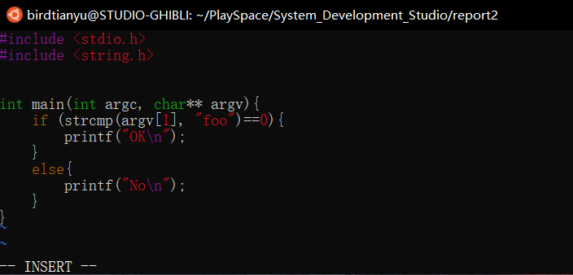

ClangのUBサニタイザで検査すると、次の出力が出てきた。

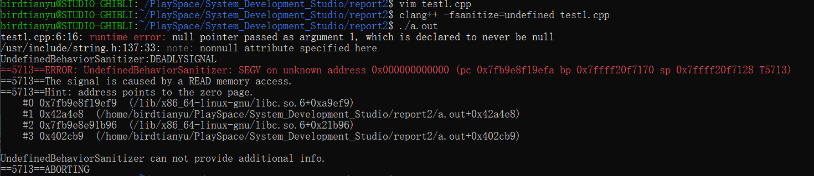

やっぱり`argv[1]`のせいです。


## 2.ブレークポイント

> ブレークポイント（ breakpoint）は、ソフトウェア開発のデバッグ作業において実行中のプログラムを意図的に一時停止させる箇所である。　　　　　　　　　　　　　　　　　　　　　　　　　　　　　　　　　　　 -- Wikipediaより


#### GDB (GNU Debugger)

「GNUデバッガ」ともいう。「GNUプロジェクト」が開発したUnix系システムで動くデバッグ用フリーソフトのこと。

詳しい説明 --> **[GDBコマンド＆使い方](https://linuxtools-rst.readthedocs.io/zh_CN/latest/tool/gdb.html)**


> **演習2　*自分のOSSプロダクトに対し，GDBでブレークポイントを設定して変数値を確認せよ***

次のプログラムを実行してみます。

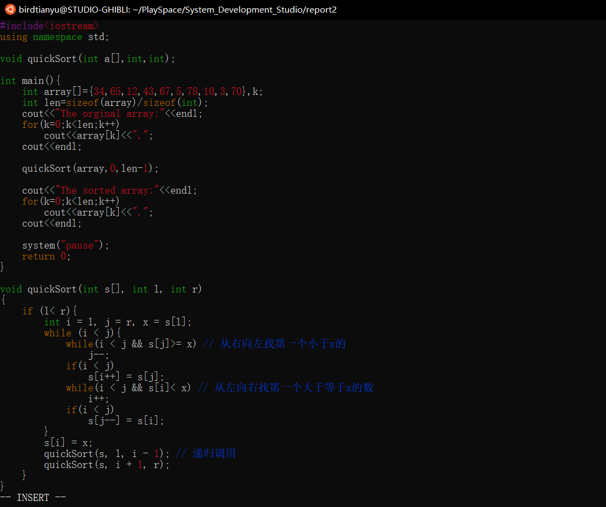

GDBでブレークポイントを設定して変数値を確認した結果：

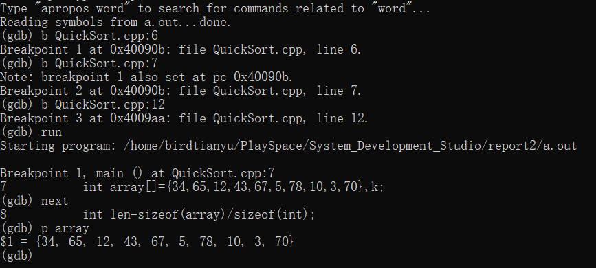


## 3. コアダンプ

**コアダンプファイル**（core dump file）とは、**UNIX系のパソコンにおいて、**プログラムが異常終了した際に出力される「core」という名前のファイルのこと。

> コアファイルが生成されるように設定:

```bash
ulimit -c unlimited
```

> **演習3　*コアダンプを利用したデバッグを試せ***

最初は`WSL(Windows Subsystem for Linux)`を使ってコアダンプファイルを生成しようとしたのですが、先生のおしゃった通り、生成できませんでした。

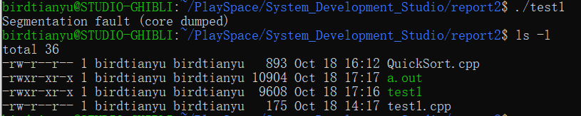

次に、生のLiunxを使って試してみました。

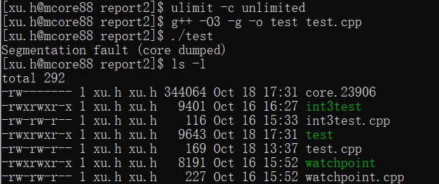

うまくコアファイルを生成しました！

コアファイルを使ってGDBでデバッグすると、

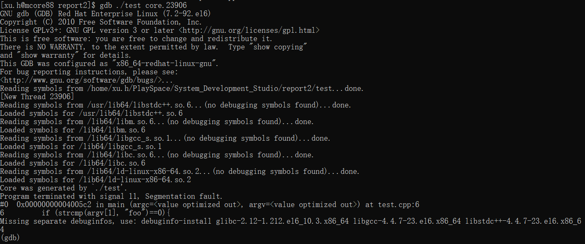

クラッシュ時点のプログラム状態を再現できます。


## 4. INT3命令

int 3命令とは、x86プロセッサの命令の１つで、実行されるとブレークポイント例外というトラップクラスの例外が発生する。

> **演習4　*自分のOSSプロダクトにint3命令を埋め込んでデバッグを実験せよ***

まず、次のテストプログラムを作ります。

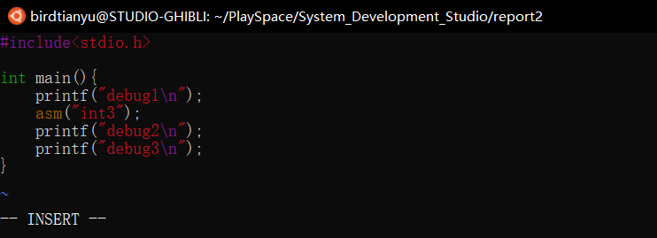

このプログラムを実行したら、ブレークポイントで停止します。

GDBでプログラムの実行を再開すると、無事に終了できます。

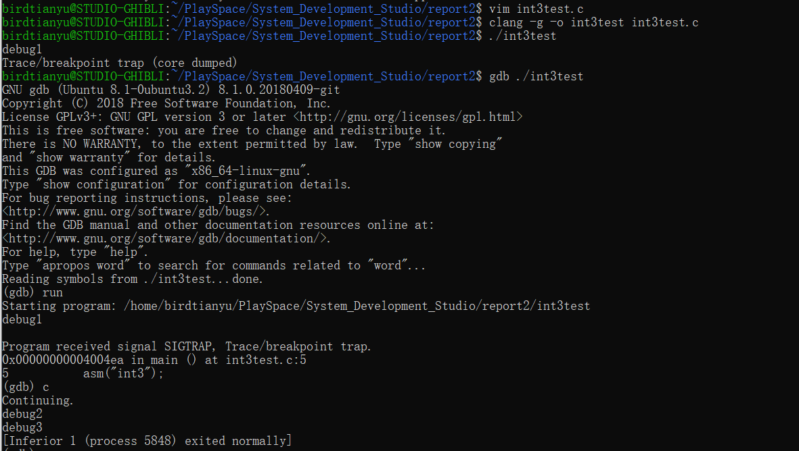


## 5. ウォッチポイント

ウォッチポイントはブレークポイントに近いものですが、ブレークポイントのように「ある地点に遭遇したら停止」ではなく、「監視している変数を操作したら停止」という流れになります。

めっちゃいい説明：https://rat.cis.k.hosei.ac.jp/article/devel/debugongccgdb2.html

> **演習5　*自分のOSSプロダクトの変数変化をウォッチポイントを用いて観察せよ***

まず、次のテストプログラムを作ります。

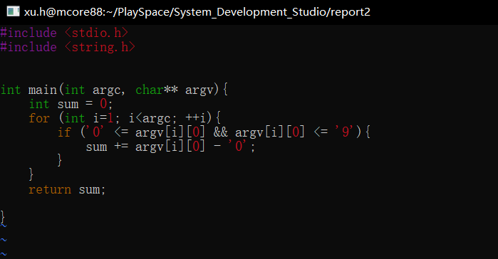

#### watchコマンド

詳しい説明 -->[watchコマンド&使い方](http://itdoc.hitachi.co.jp/manuals/3020/30203S3530/JPAS0178.HTM)


以下の引数を使って、プログラムを起動します。

```c++
3 b c 9
```

watchコマンドで`sum`変数変化を観察します。

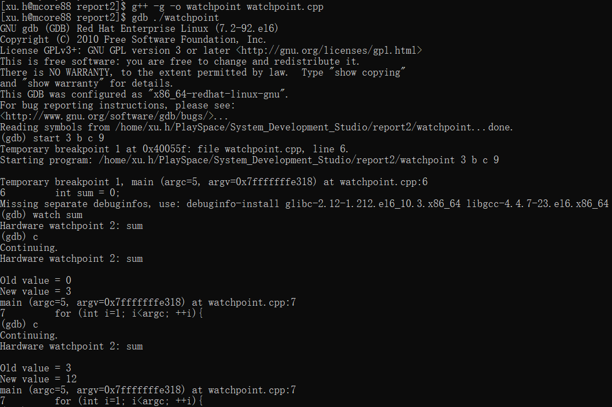


#### ※ ハードウェアウォッチポイント **VS** ソフトウェアウォッチポイント

ハードウェアウォッチポイント --> CPUの機能としてメモリ読み書きを監視できる（**低オーバーヘッド**）

ソフトウェアウォッチポイント --> ソフトウェアでメモリ変更を監視（**高オーバーヘッド**）


**ソフトウェアウォッチポイントが使われる条件:**

利用できるハードウェアウォッチポイントは限られるため、ハードウェアウォッチポイントに使用するレジスタがいっぱいになると、ソフトウェアウォッチポイントを使用する必要がありますが、この時に出来るだけハードウェアウォッチポイントの数をコントロールしてハードウェアウォッチポイントを使っていいと思います。


> **演習6　*自分のOSSプロダクトのデバッグを作業記録を取りながら行おう***

PDBを使って、私の作成したPython OSSプロダクトをデバッグします。

>  私のプロダクトについて：https://github.com/birdtianyu/LedgerMagic

#### PDB とは？

[PDB](https://docs.python.org/zh-cn/3/library/pdb.html)はPythonプログラム用の対話型ソースコードデバッガを定義します。 (条件付き)ブレークポイントの設定やソース行レベルでのシングルステップ実行、スタックフレームのインスペクション、ソースコードリスティングおよびあらゆるスタックフレームのコンテキストにおける任意の Python コードの評価をサポートしています。事後解析デバッギングもサポートし、プログラムの制御下で呼び出すことができます。

#### よく使うコマンド

| コマンド | 意味                                                 |
| :------- | :--------------------------------------------------- |
| n        | next。次のステップを実行                             |
| c        | continue。次のデバッグポイントまで全コードを実行     |
| l        | list。現在いるところの前後のソースコードを表示する。 |
| q        | quit。プログラムを終了する。                         |
| r        | return ステップアウト                                    |
| a        | args 現在いる関数の引数を表示                                |
| p        | print プリント                                         |

まず、`test.py`の中に`pdb`というモジュールをインポートして設定します。

```python
import pdb
pdb.set_trace()
```

次のコマンドで実行します。

```bash
python3 -m pdb test.py
```

> -m mod : run library module as a script (terminates option list)


`test.py`ファイルには[Google Clond Vision API](https://cloud.google.com/vision)を利用して画像認識の機能を実装しています。

`test.py`ファイルの内容：

``````Python
import io
import os
import pdb

# Imports the Google Cloud client library
from google.cloud import vision
from google.oauth2 import service_account

pdb.set_trace()

credentials = service_account.Credentials.from_service_account_file('Project-491c3b474809.json')
client = vision.ImageAnnotatorClient(credentials=credentials)

# The name of the image file to annotate
file_name = os.path.abspath('result.jpg')

# Loads the image into memory
with io.open(file_name, 'rb') as image_file:
    content = image_file.read()

image = vision.Image(content=content)

# Performs label detection on the image file
response = client.label_detection(image=image)
labels = response.label_annotations

pdb.set_trace()

print('Labels:')
for label in labels:
    print(label.description)
``````


テスト用の画像：


デバッグのプロセス：

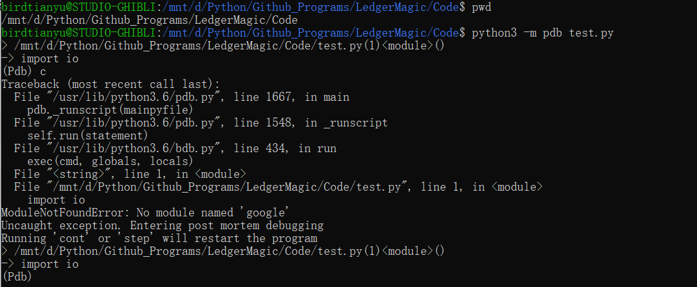

`google`モジュールと`google-cloud-vision`モジュールはまだ正しくインストールされなさそうです。

以下のコマンドでもう一度インストールします。

``````bash
pip install --upgrade google-cloud-vision
``````

もう一度デバッグします。

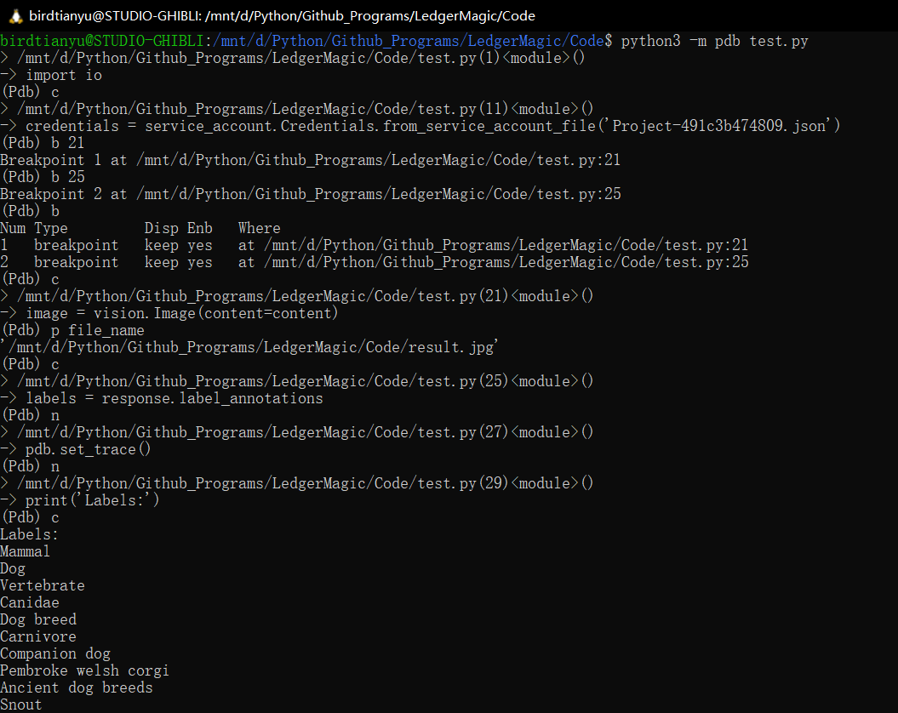

`pdb.set_trace()`を実行すると、デバッグ情報は初期化されますので、上記二つの`pdb.set_trace()`の間のコードを相手にうまくデバッグ出来ました。

ちなみに、プログラムが認識した結果は

``````
Mammal
Dog
Vertebrate
Canidae
Dog breed
Carnivore
Companion dog
Pembroke welsh corgi
Ancient dog breeds
Snout
``````

やはりGoogleさんのAPIの識別精度は非常に高いですね！

`Pembroke welsh corgi`の正解さえありました！
