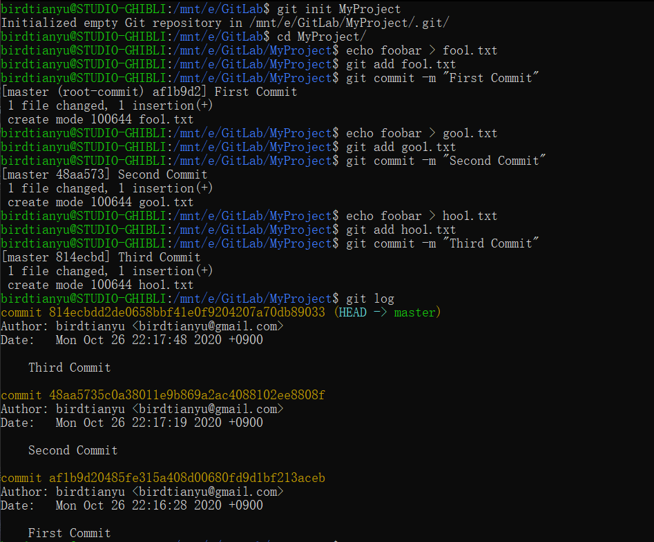
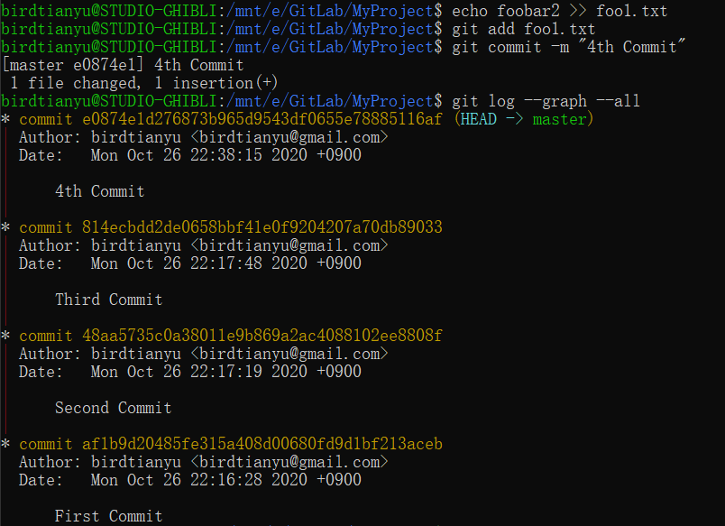
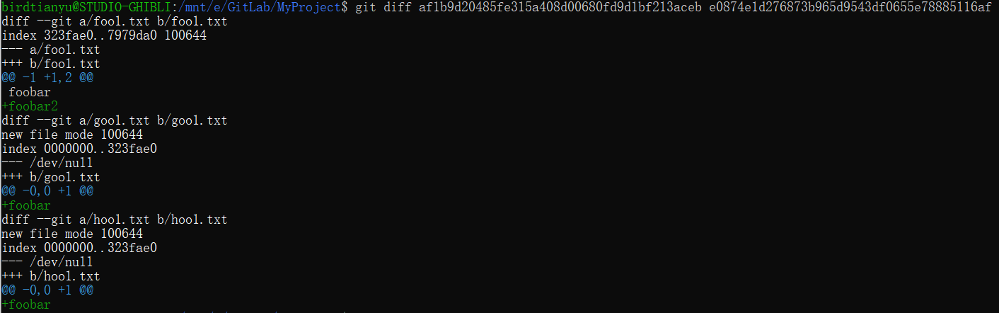
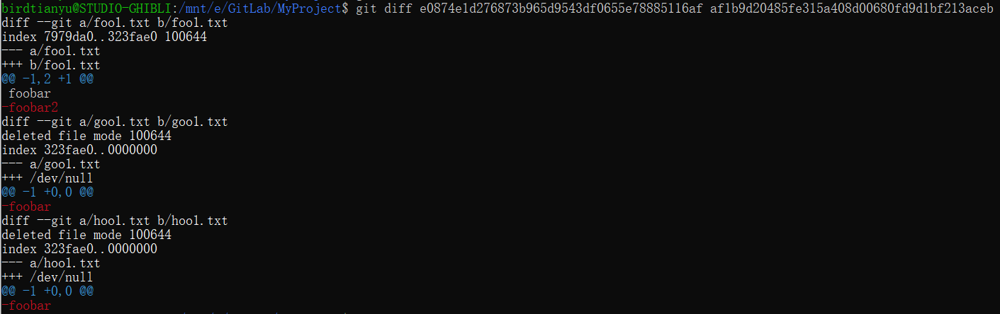
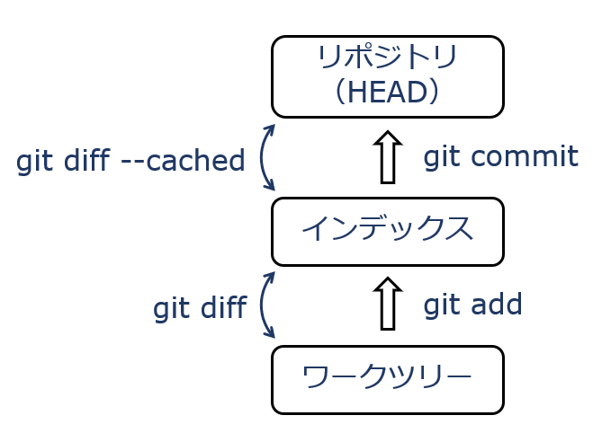
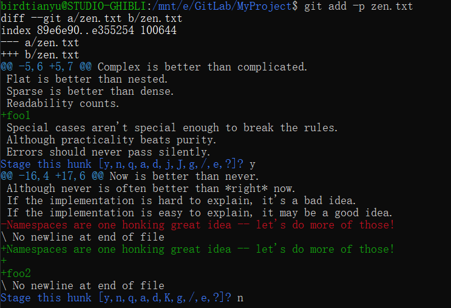

# Gitによるバージョン管理のレポート

## 名前: Xu Hongkun  　学籍番号: 20M31378


# Git

> Linuxカーネル開発のためにリーナスが開発した。

#### 基本操作


> - Workspace：工作区
> - Index / Stage：暂存区
> - Repository：仓库区（或本地仓库）
> - Remote：远程仓库


| **コマンド**             | **意味**                                                     |
| ------------------------ | ------------------------------------------------------------ |
| git  init                | リポジトリを新規に作る                                       |
| git  add [-p] foo        | ファイルfooをステージする  [-p --patch  修正した内容の一部を提出] |
| git  commit -m "message" | メッセージ  “message” を付けてコミット                       |
| git  log [--graph --all] | コミット履歴を見る  [ --graph コミット履歴をグラフ構造で表示   --all すべてのブランチを表示 ] |
| git  status              | 現在の状況を表示する                                         |


#### Useful Website:

+ [基礎知識](https://www.ruanyifeng.com/blog/2015/12/git-cheat-sheet.html)

+ [幅広い解説1](https://www.yiibai.com/git/git_basic_concepts.html),  [幅広い解説2](https://www.cnblogs.com/syp172654682/p/7689328.html),  [幅広い解説3](https://www.bookstack.cn/read/git-tutorial/docs-basic.md)

+ [Learn Git Branching](https://learngitbranching.js.org/?locale=zh_CN)


#### Gitの初期設定（git config） 

``````bash
$ git config --global user.name "your name"
$ git config --global user.email "your email"
$ git config --global init.defaultBranch master
``````

`--global`を使うと、全てのリポジトリはこちらの設定を使います。

``````bash
$ git config --list --show-origin
``````

現在の設定値を表示する。


> **演習1　*リポジトリを新規作成し，変更を3回程度コミットせよ***
``````bash
$ git log
``````


``````bash
$ git log --graph --all
``````



> **演習2　*各コミット間の差分を確認せよ***

#### git diff 

``````bash
$ git diff コミットA コミットB
``````

コミットA→コミットBの差分を見る。（この差分をコミットAに加えるとコミットBになる）

```````bash
$ git diff
```````

index→workspaceの差分を見る。（コミット前に変更を確認するのに便利）


例：`git diff 1st_commit 4th_commit`



`git diff 4th_commit 1st_commit`




> **演習3　*一部のハンク(hunk, 块)だけ`git add`し，2種類の差分を確認せよ***



``````bash
$ git add -p ファイル名
``````

修正したファイルの一部を提出する。(大量の行を含む必要がある)



``````bash
$ git diff
``````


``````bash
$ git diff --cached
``````


> **演習4　*特定の時点のファイル内容を確認せよ***

#### ※ ブランチはただのラベル


#### ※ \<HEAD\>は現在作業中のコミットを指す特別なラベル


   **Detached HEAD**：ブランチから外れて特定のコミットを指した状態（**調査用**）

（此时commit不会有任何影响，因为最终都会被丢弃，因此必须建立新的分支才能保存commit的内容）


#### ※タグ＝コミットのID名

``````bash
$ git tag <タグ名> [COMMIT ID]
``````


#### git checkout 

> \<HEAD\>を特定のブランチやコミットに設定する。(※ ワークツリーとインデックスをHEADの内容に更新する)

+ 新たなブランチを作成し、そのブランチに移動する

``````bash
$ git checkout -b <new branch name>
``````

+ masterの親ノードに移動する。

``````bash
$ git checkout master^
``````

+ masterの親ノードの一つの上(２代前の親)に移動する。

``````bash
$ git checkout master^^
``````

+ masterの親n代前へと移動する。

``````bash
$ git checkout master~n
``````

+ (master^默认**正上方**那个父结点， master^2第二个父结点）

``````bash
$ git checkout master^n
``````


+ **その時点のファイルの内容に変更する。**

``````bash
$ git checkout commit_ID file_name
``````


+ masterブランチを（強制的に）HEADより親三代前へと移動する (`-f`オプション)

``````bash
git branch -f master HEAD~3
``````


#### git show

> 显示某个Commit的更改内容

``````bash
$ git show commit_ID
``````


> **演習5　*新しく作ったブランチに変更をいくつかコミットせよ，途中でタグを打て***


``````bash
$ git tag tag-a
``````


``````bash
$ git log --decorate==full --graph
``````


> **演習6　*`br-a`を`main`にマージせよ。`br-a`と`main`に競合するコミットを加え，さらにマージせよ。***

#### 2-way Merge と 3-way Merge (Git)

+ 参考：[「Gitの3-way mergeとは具体的にどのようなアルゴリズムですか？」](https://ja.stackoverflow.com/q/52019)


#### Fast-forward Merge

単にポインタを動かすだけで事足りる状況

``````bash
$ git merge --no-ff dev -m "commit message"
``````


#### 競合（Conflict）

同じ個所を同時並行で変更すること。どちらの変更を採用すべきか自動決定できない


競合発生：


`git status`で競合するファイルを確認する。


`zen.txt`の中身を見ると、

``````
<<<<<<< HEAD
Unless Master silenced.(もとの内容)
=======
Unless br-a commit silenced.(マージしようとした内容)
>>>>>>> br-a
``````

このファイルを修正し、もう一度`commit`するだけで済む。

``````bash
$ git add zen.txt
$ git commit -m "changed"
``````

その結果、


> **演習7　*`br-b`と`main`にいくつかコミットし，`br-b`を`main`にリベースせよ***

#### git cherry-pick

+ Cherry picking: サクランボの熟した果実だけを選別すること

[参考ウェブサイト]( https://www.ruanyifeng.com/blog/2020/04/git-cherry-pick.html)

``````bash
$ git cherry-pick Commit_ID1 [Commit_ID2] [...]
``````


#### git rebase

作業が完了したブランチを分岐元のブランチにくっつける時に使う機能の一つです。

[参考ウェブサイト](https://www.sejuku.net/blog/71919)

``````bash
$ git rebase 
``````


まず、`br-b`というブランチを作って、いくつか`commit`する。


br-bをmasterにリベースする。


> **演習8　*`git rebase -i`でコミット順とコミットメッセージを修正してみよ***

#### git reflog

ブランチが過去にどのコミット(ID)を指していたかを見る。


####  git rebase -i

+ コミット順を並び替え
+ コミットメッセージの変更を指示

`-i` 交互式（可以重新排序或删除）

``````bash
$ git rebase -i <start commit ID>
``````


エディタを変えたいときはEDITOR環境変数を設定

``````bash
$ export EDITOR=vim
``````


`br-b 2nd Commit`は`br-b 1st Commit`に基づいて内容を増やす操作なので、コミット順番は変えない。

まず、新しいコミットを作った。


以下のように編集して、実行すると、


次のようにうまく出来た。


#### git commit --amend

更改最近一次提交的commit message和内容

+ amend: 改良

``````bash
$ git commit --amend
``````


> **演習9　*ファイルを変更して`git add`し，変更をなくさずにgit addを取り消せ***

#### 変更を元に戻す（git reset VS git revert）

1. `reset`はブランチのポインタを後方に移動することで変更のキャンセルを実現（※  ***Local***: ローカルリポジトリに対して ）

``````bash
$ git reset <node name>
``````

2. `revert`は**新しいコミットを作って**、巻き戻す。

``````bash
$ git revert <node name>
``````


#### git stash

コミットしたくないけど無くなると困る変更。（一時的に変更を隠しておく）

比如我现在想要切换到分支b。但是由于我修改了一些文件，无法切换分支。

我不想把这些修改提交了再切换，在这时可以使用：

``````bash
$ git stash save
``````

暂存更改。可以使用

``````bash
$ git stash list
``````

查看缓存了哪些未提交的修改。下一次切换回来时，可以使用

``````bash
$ git stash pop
``````

还原当前状态。


実行した結果：


> **演習10　*GitHubで良い/悪いコミットメッセージの例を探せ***

#### [Gitのコミットメッセージの書き方](https://qiita.com/itosho/items/9565c6ad2ffc24c09364)


> **演習11　*Gitの操作を練習サイトで練習しよう***

練習サイト: https://learngitbranching.js.org/

全ての練習問題を解決しました。

