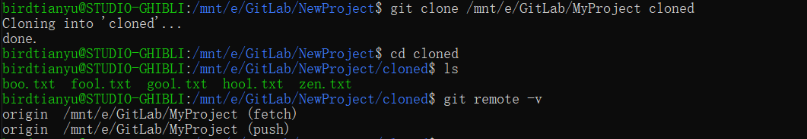
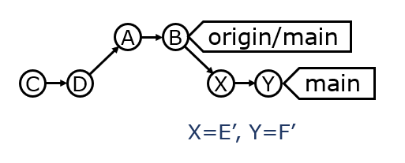
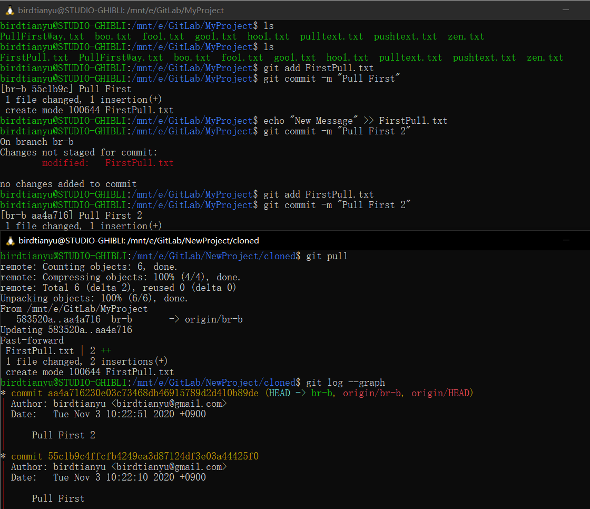
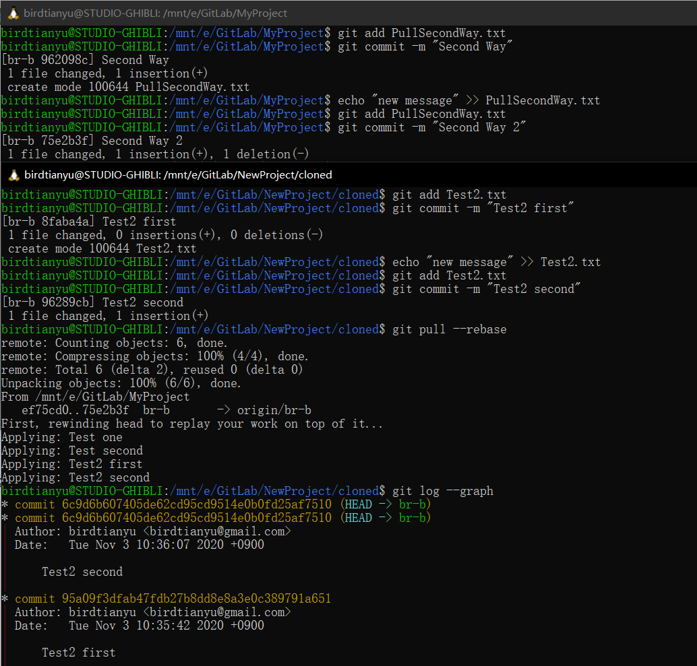

# Github Pull Requestのレポート

## 名前: Xu Hongkun  　学籍番号: 20M31378


## Github Pull Request

> **演習1　*ローカルマシン内の`Git`リポジトリを別のディレクトリに複製し`origin`を確認せよ***


#### git remote

> 追跡されているリモートリポジトリを表示・管理する

追跡されているリモートリポジトリを一覧する

``````bash
$ git remote -v
``````

`alice.com`上の`great-app`リポジトリを`alice_project`という名前で追加

``````bash
$ git remote add alice_project john@alice.com:great-app.git
``````





> **演習2　*ローカルマシン内で以下を実験せよ;***
> 
> ​             ***リモートリポジトリに`commit`して`pull`, 複製したリポジトリに`commit`して`push`***


[詳しくはこちら](http://www.ruanyifeng.com/blog/2014/06/git_remote.html)


#### git pull

リモートリポジトリと同期する。

``````bash
$ git pull <remote machine name> <remote branch name>[:<local branch name>]
``````

#### git push

リモートリポジトリにローカルリポジトリの変更を反映する。

``````bash
$ git push <remote machine name> <local branch name>[:<remote branch name>]
``````

#### git fetch

リモートレポジトリからファイルをダウンロードするが, ローカルレポジトリのファイルは変更しない.

```````bash
$ git fetch <remote machine name> [<branch names>]
```````


#####  ①Test git pull


##### ②Test git push


すると、エラーが出てきた

``````
Counting objects: 3, done.
Delta compression using up to 8 threads.
Compressing objects: 100% (2/2), done.
Writing objects: 100% (3/3), 286 bytes | 286.00 KiB/s, done.
Total 3 (delta 1), reused 0 (delta 0)
remote: error: refusing to update checked out branch: refs/heads/br-b
remote: error: By default, updating the current branch in a non-bare repository
remote: is denied, because it will make the index and work tree inconsistent
remote: with what you pushed, and will require 'git reset --hard' to match
remote: the work tree to HEAD.
remote:
remote: You can set the 'receive.denyCurrentBranch' configuration variable
remote: to 'ignore' or 'warn' in the remote repository to allow pushing into
remote: its current branch; however, this is not recommended unless you
remote: arranged to update its work tree to match what you pushed in some
remote: other way.
remote:
remote: To squelch this message and still keep the default behaviour, set
remote: 'receive.denyCurrentBranch' configuration variable to 'refuse'.
To /mnt/e/GitLab/MyProject
 ! [remote rejected] br-b -> br-b (branch is currently checked out)
error: failed to push some refs to '/mnt/e/GitLab/MyProject'
``````

`git push origin br-b:br-b`もダメでした

いろいろ調べて、[答えを見つかった](https://stackoverflow.com/questions/2816369/git-push-error-remote-rejected-master-master-branch-is-currently-checked)。リモートリポジトリで`git checkout someotherbranch`したら大丈夫だ。


> **演習3　*複製したリポジトリ間で`Pull`の2つの戦略を実験せよ***

#### git pull

+ Fetchにより取得した更新を，現在のブランチにマージ


#### git pull --rebase

+ Fetchにより取得した更新を，リベースにより適用

+ 歴史が直線的になる




1. 片方のリポジトリにだけ変更を加えた場合（あんまり変わらない）

`git pull`




`git pull --rebase`


2. 両方のリポジトリを変更した場合（区別がある）

`git pull`


`git pull --rebase`




> **演習4　*GitHubで空のリポジトリを作り，手元で構築したリポジトリをpushせよ***

`origin`が存在したら、まず削除する必要がある。

```bash
$ git remote rm origin
```


新しいリポジトリ：https://github.com/birdtianyu/XuHongkun-sysdev-2020

``````bash
$ git remote add origin https://github.com/birdtianyu/XuHongkun-sysdev-2020.git
$ git branch -M main
$ git push -u origin main
``````


> **演習5　*ブランチ`br-dev`を切り、いくつかコミットし`Pull Request`を出せ***

### ブランチモデル：

> ブランチの使い方を規定するモデル

#### Git flow *&* Github flow *&* Gitlab flow

http://www.ruanyifeng.com/blog/2015/12/git-workflow.html


いくつかコミットした結果：


> **演習6　*ブランチ`br-dev`の`Pull Request`上でコードにコメントし、コミットをいくつか追加し、マージせよ***

①  コミットをいくつか追加し、コードにコメントします。


② マージします。


マージした結果：


> **演習7　*受講生誰かのリポジトリを`Fork`し、手元に`Clone`して`remote`を確認せよ***

`github`の`long-long-float`さんの`test-sysdev-2020`リポジトリを`Fork`しました。

`Fork`先のリポジトリ：https://github.com/long-long-float/test-sysdev-2020

`clone`して`remote`を確認した結果：


> **演習8　*`Fork`したリポジトリにコミットし，リポジトリ間`Pull Request`を作成せよ。
> 受信した`Pull Request`上で追加コミットを促し，コミットされたらマージせよ***

① `Fork`したリポジトリにコミットし，リポジトリ間`Pull Request`を作成します。


② `long-long-float`さんとのやり取り：


