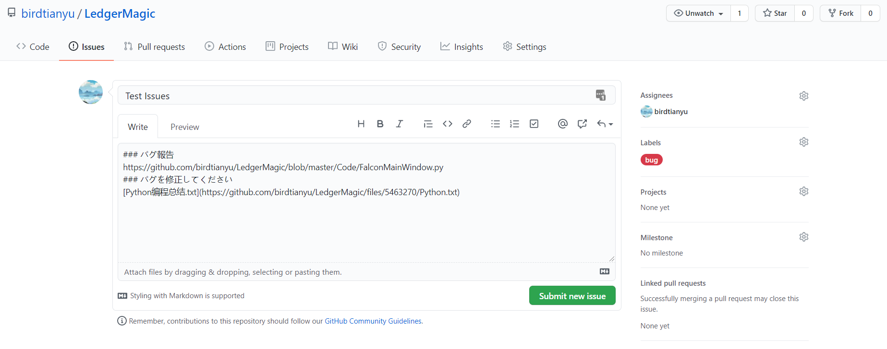
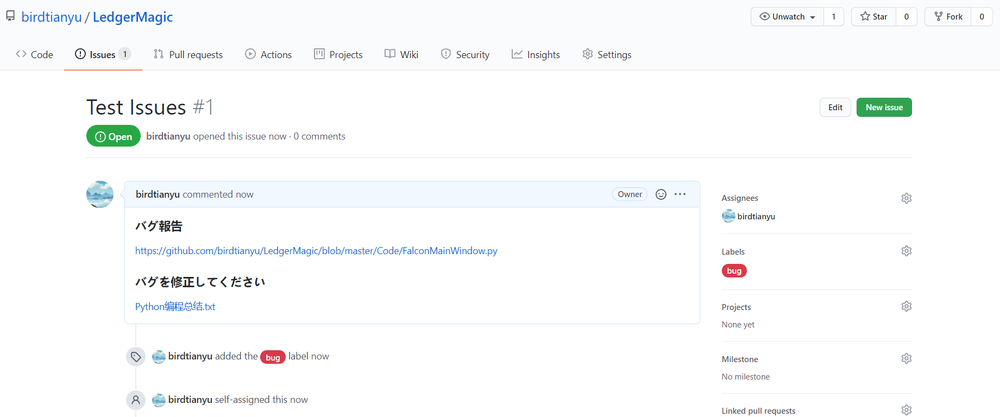
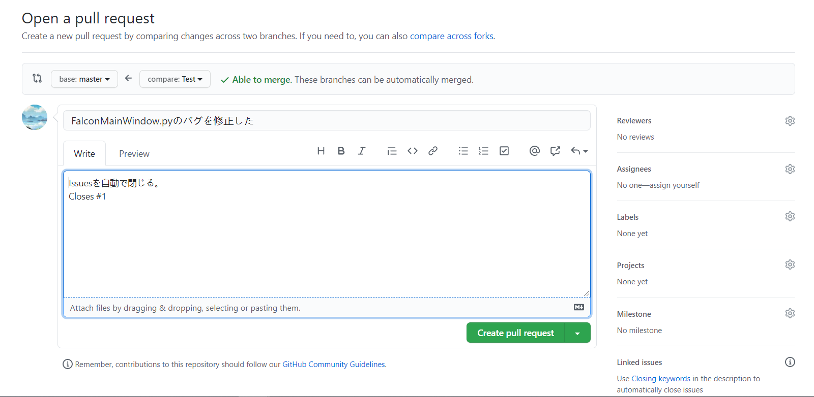
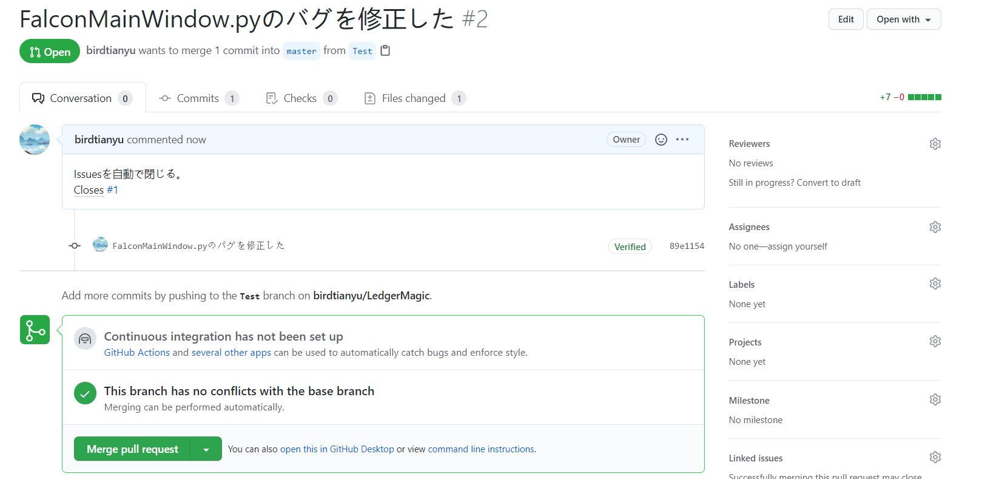
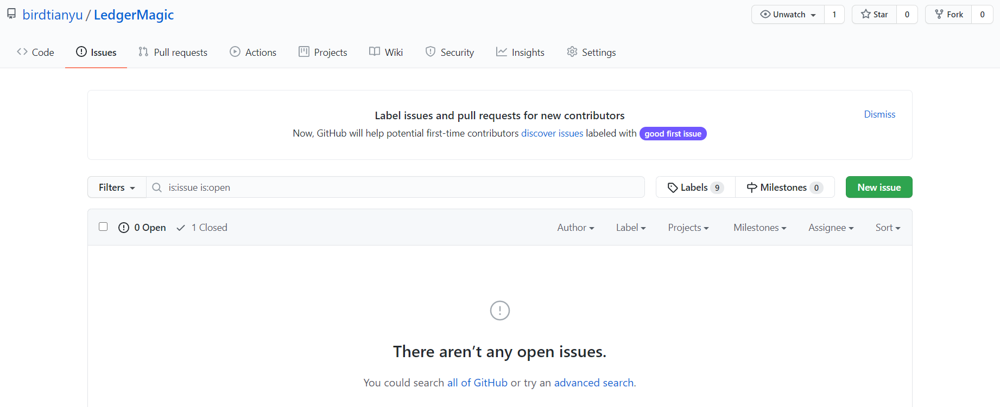

# バグトラッキングのレポート

## 名前: Xu Hongkun  　学籍番号: 20M31378

## バグトラッキング

> **演習1　*普段使っているOSSに関するバグ報告をいくつか探せ***

普段使っているSingularityというOSSの公式サイト：https://singularity.lbl.gov

Github Issues上バグ一覧：https://github.com/hpcng/singularity/issues?q=is%3Aopen+is%3Aissue+label%3ABug

> **演習2　*良いバグ報告と悪いバグ報告を探せ***

[プログラマに優しいバグレポートの書き方](https://www.slideshare.net/KatsutoshiMakino/ss-11011148)

> **演習3　*自分のOSSに対しIssueを投稿し、修正コミットを投げてIssueを自動で閉じよ***

#### ①Issueを作る

#### ②pull requestを作る

#### ③Issueがなくなりました。

