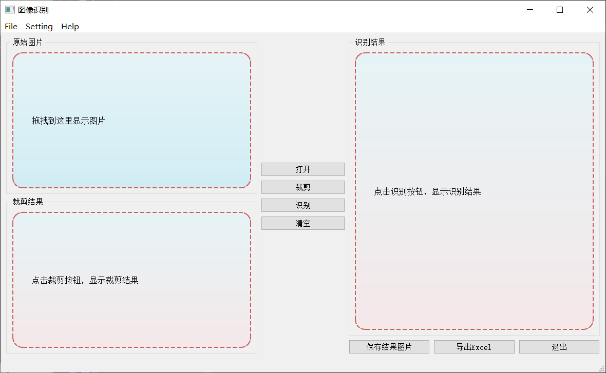

# ユニットテストのレポート

## 名前: Xu Hongkun  　学籍番号: 20M31378


## ユニットテスト

> **演習1　*自分のOSSにテストを一つ追加せよ***

テストOSS：https://github.com/birdtianyu/LedgerMagic/tree/master/Code

もともとテストスクリプトが入っています。こちらのコードです。

``````python
import io
import os
import pdb

# Imports the Google Cloud client library
from google.cloud import vision
from google.oauth2 import service_account

pdb.set_trace()

credentials = service_account.Credentials.from_service_account_file('Project-491c3b474809.json')
client = vision.ImageAnnotatorClient(credentials=credentials)

# The name of the image file to annotate
file_name = os.path.abspath('result.jpg')

# Loads the image into memory
with io.open(file_name, 'rb') as image_file:
    content = image_file.read()

image = vision.Image(content=content)

# Performs label detection on the image file
response = client.label_detection(image=image)
labels = response.label_annotations

pdb.set_trace()

print('Labels:')
for label in labels:
    print(label.description)
``````

こちらのコードはGoogle Cloud Vision APIの機能をテストするためのコードです。

UIテスト(ファイルの開き、クローズ)も行いました。こちらはシステムのメイン画面です。




> **演習2　*テストフレームワークを使って自分のOSSにテストを追加せよ***

#### Python unittest ライブラリ

ドキュメント：https://docs.python.org/zh-cn/3/library/unittest.html

テスト用のコード(./XuHongkun/Sample.py)：

``````python
class Count:
    def __init__(self, a, b):
        self.a = int(a)
        self.b = int(b)

    # addition
    def add(self):
        return self.a + self.b
``````

`unittest`を使ってテストを行います。

``````python
from Sample import Count
import unittest

class TestAdd(unittest.TestCase):
    def setUp(self):
        print('test start')

    def test_add(self):
        j = Count(2, 3)
        self.assertEqual(j.add(), 5, 'error！')

    def tearDown(self):
        print('test end')


if __name__ == '__main__':
     suite = unittest.TestSuite()
     suite.addTest(TestAdd('test_add'))

     runner = unittest.TextTestRunner()
     runner.run(suite)
     print('Finish!')
``````

実行した結果：


> **演習3　*テスト駆動開発により自分のOSSに機能を追加せよ***

`Help`の`About`メニューをクリックしたら、私の`Github`にジャンプする機能を追加します。


①コンパイルが失敗：`jump`という属性がない。


実装が空の関数を書いたあと：

②テストが失敗：ウェブサイトにジャンプしない。

関数を実装すると

``````python
def jump(self, URL):
        return webbrowser.open(URL)
``````

③テストが成功：`Help`の`About`メニューをクリックすると、私の`Github`ホームページにジャンプした。

> 追加した機能をOSSのリポジトリにも更新した。


> **演習4　*`TDD`+モブプログラミングで`100 doors`を解け***

#### TDD(Test-driven development,**テスト駆動開発**)

プログラム開発手法の一種で、プログラムに必要な各機能について、最初にテストを書き（これをテストファーストと言う）、そのテストが動作する必要最低限な実装をとりあえず行った後、コードを洗練させる、という短い工程を繰り返すスタイルである。


#### モブプログラミング(Mob programming)

複数人が同時に同じ課題に取り組むプログラミング手法

> ドライバー（1人）：コードを書く
>
> ナビゲーター（その他）：ドライバーに指示する


問題：

100 doors in a row are all initially closed. You make 100 passes by the doors. The first time through, you visit every door and toggle the door (if the door is closed, you open it; if it is open, you close it).
The second time you only visit every 2nd door (door #2, #4, #6, ...).
The third time, every 3rd door (door #3, #6, #9, ...), etc, until you only visit the 100th door.

Question: What state are the doors in after the last pass? Which are open, which are closed?


答え：

``````c
#include "hiker.h"

int doors[100] = {0};

int* pass (int arr[], int size, int start)
{
    int step = start + 1;
    for(int i = start; i < size; i = i + step) {
        arr[i] = (arr[i] + 1) % 2;
    }
    return arr;
}

int answer(void)
{
    int count = 0;
    int SIZE = 100;
    
    for(int start = 0; start < SIZE; start++){
        pass(doors, SIZE, start);
    }
    
    for(int i = 0; i < SIZE; i++){
        if(doors[i]==1){
            count += 1;
        }
    }
    
    // 最後に開いているドアの数
    return count;
}
``````


