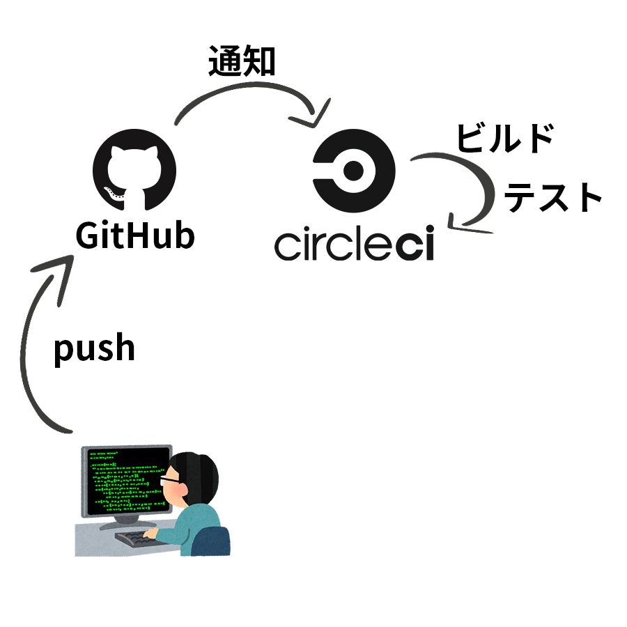
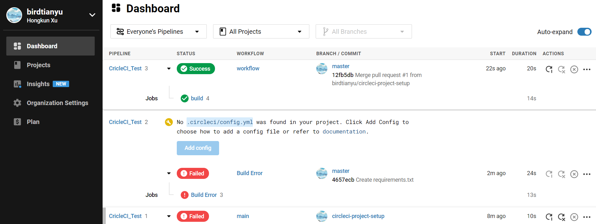
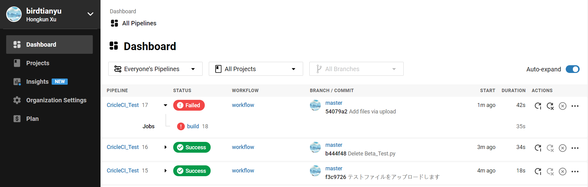
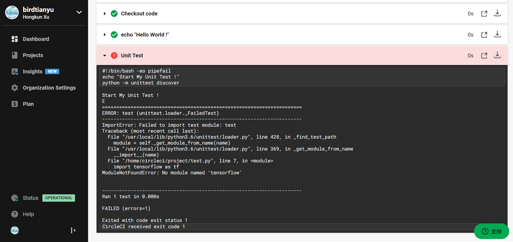
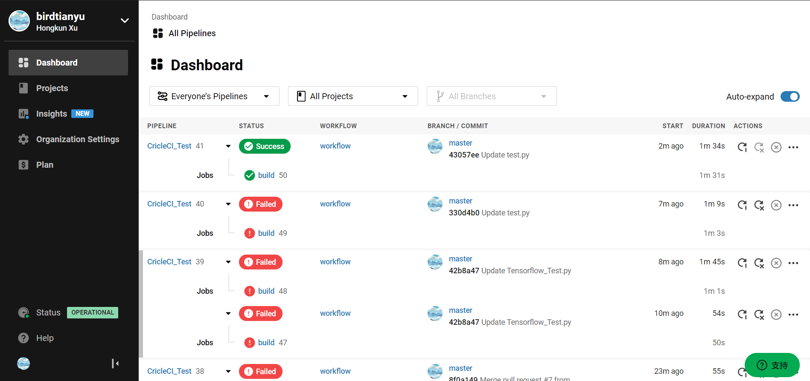
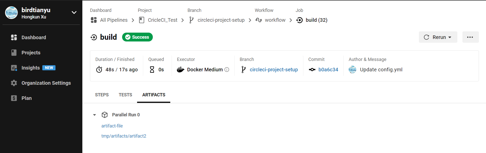

# 継続的インテグレーションのレポート

## 名前: Xu Hongkun  　学籍番号: 20M31378


## 継続的インテグレーション

> **演習1　*`CircleCI`を使っているOSSを2つ探し，`CircleCI`の設定を読み，何をしているか調査せよ***


#### インテグレーション(integration)

インテグレーションとは、「統合」を意味する言葉だと覚えておくと良いでしょう。
システムインテグレーションとは、システムによって問題を解決（ソリューション）し、顧客の要望を情報システムにて構築するサービスのことでもあります。

> SI(System Integrator): サブシステムを集め，全体として機能するよう調整して納入する業態の企業。


#### 継続的インテグレーション(Continuous Integration)

変更をコミットするたびに自動化されたビルドとテストを実行すること。


https://www.ruanyifeng.com/blog/2015/09/continuous-integration.html

https://www.zhihu.com/question/23444990


#### CIを支援するツール

+ Jenkins

  > CIツールの元祖
  >
  > 自前サーバーにインストールして使う

+ TravisCI/CircleCI

  > GitHubなどで手軽に使える
  >
  > 小規模な使用なら無料
  >
  > 設定例が豊富

+ GitHub Actions

  > GitHub公式のビルド自動化システム
  >
  > Issue/PRなどとの連携性が高い

  

#### CircleCI





[初心者必見！ CircleCIでHello Worldしてみよう！](https://qiita.com/yassun-youtube/items/2a09d5b1b56feace8156)


OSS1:https://github.com/CircleCI-Public/circleci-demo-python-django

``````yml
version: 2.1
orbs:
  python: circleci/python@1.0.0
jobs:
  build:
    docker:
      - image: cimg/python:3.6.10
        environment:
          DATABASE_URL: postgresql://root@localhost/circle_test?sslmode=disable
      - image: circleci/postgres:9.6.2
        environment:
          POSTGRES_USER: root
          POSTGRES_DB: circle_test
    steps:
      - checkout
      - python/install-packages
      - run:
          name: Run django tests
          command: |
            pipenv run python manage.py test
      - store_test_results:
          path: test-results
      - store_artifacts:
          path: test-results
          destination: tr1
``````

OSS1は二つの Docker イメージ（`cimg/python:3.6.10`と`circleci/postgres:9.6.2`）を使用し、`pipenv run python manage.py test`というコマンドを実行します。


OSS2:https://github.com/fabinhojorge/OCR_web

``````yml
version: 2
jobs:
  build:
    working_directory: ~/urlshortner
    docker:
      - image: circleci/python:3.6.4
        environment:
          CIRCLE_CI_ENVIRONMENT: true
          DATABASE_URL: postgresql://root@localhost/circle_test?sslmode=disable
      - image: circleci/postgres:9.6.2
        environment:
          POSTGRES_USER: circleci
          POSTGRES_DB: circle_test
    steps:
      - checkout

      - restore_cache:
          keys:
          - v1-dependencies-{{ checksum "requirements.txt" }}
          - v1-dependencies-

      - run:
          name: Install Dependencies
          command: |
            python3 -m venv venv
            . venv/bin/activate
            pip install -r requirements.txt
            pip install psycopg2-binary
      - save_cache:
          paths:
          - ./venv
          key: v1-dependencies-{{ checksum "requirements.txt" }}

      - run:
          name: Run Tests
          command: |
            . venv/bin/activate
            python manage.py makemigrations
            python manage.py migrate
            python manage.py test
``````

OSS2は二つの Docker イメージ（`circleci/python:3.6.4`と`circleci/postgres:9.6.2`）を使用し、複数のコマンドを実行します。


> **演習2　*自分のOSSに`CircleCI`を導入し，`Push`時にハローワールドを表示させよ***

テストOSS：https://github.com/birdtianyu/CricleCI_Test

``````yml
version: 2.1
jobs:
  build:
    docker:
      - image: circleci/python:3.6.4
    steps:
      - checkout
      - run: echo "Hello World !"
``````




実行した結果は上図の通りである。


> **演習3　*`CircleCI`を用いて，自分のOSSのテストを自動で実施せよ***

`CircleCI`の設定にテストを実行するステップを加える

``````yml
version: 2.1
jobs:
  build:
    docker:
      - image: circleci/python:3.6.4
    steps:
      - checkout
      - run: echo "Hello World !"
      - run:
          name: Unit Test
          command: |
            echo "Start My Unit Test !"
            sudo pip install --upgrade pip
            sudo pip install -r requirements.txt
            python -m unittest discover 
``````



新しいスクリプトをアップロードしてテストを行う時に、エラーが発生しました。



`tensorflow`というライブラリがない。

次に、`requirements.txt`を修正し、`tensorflow`というライブラリを追加する。


コードの中にエラーもあります。

エラーを修正して、何度も試してみた結果、成功になりました。




> **演習4　*`CircleCI`を用いてアーティファクトを自動でアップロードせよ***


#### ビルドアーティファクト(artifact)

ビルドに伴い生成されるファイル群のこと

保存する方法：[ビルド アーティファクトの保存 - CircleCI](https://circleci.com/docs/ja/2.0/artifacts/)


下の設定にしたがって、実行しました。

``````yml
version: 2.1
jobs:
  build:
    docker:
      - image: circleci/python:3.6.4
    steps:
      - checkout
      - run: echo "Hello World !"
      - run:
          name: ダミー アーティファクトの作成
          command: |
            echo "my artifact file" > /tmp/artifact1;
            mkdir /tmp/artifacts;
            echo "my artifact files in a dir" > /tmp/artifacts/artifact2;
      - store_artifacts:
          path: /tmp/artifact1
          destination: artifact-file

      - store_artifacts:
          path: /tmp/artifacts
          
      - run:
          name: Unit Test
          command: |
            echo "Start My Unit Test !"
            sudo pip install --upgrade pip
            sudo pip install -r requirements.txt
            python -m unittest discover  
``````


#### store_artifacts

- `path` は、アーティファクトとしてアップロードされるファイルまたはディレクトリのパスです。
- `destination` **(オプション)** は、アーティファクト API でアーティファクト パスに追加されるプレフィックスです。 `path` で指定されたファイルのディレクトリがデフォルトとして使用されます。


ビルド結果：




