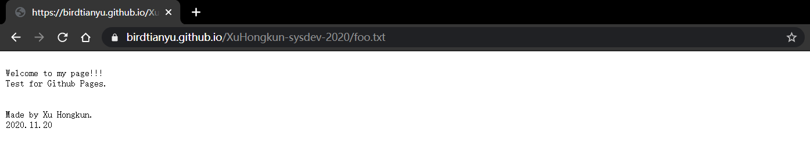
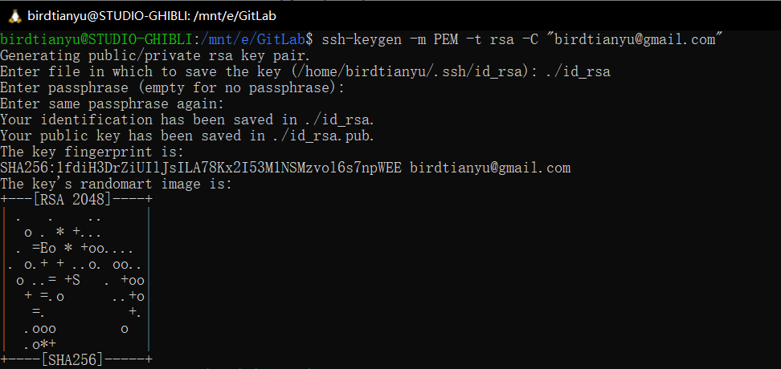
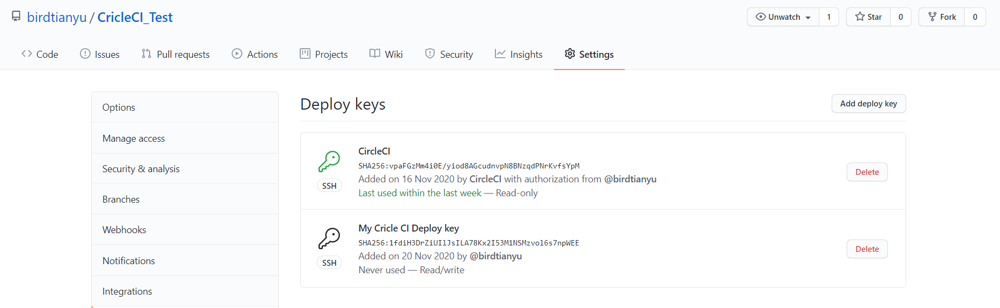
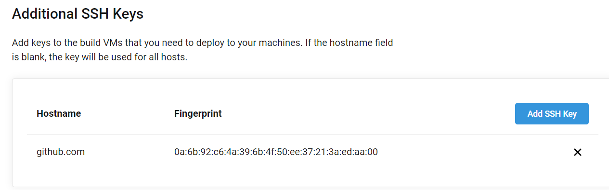
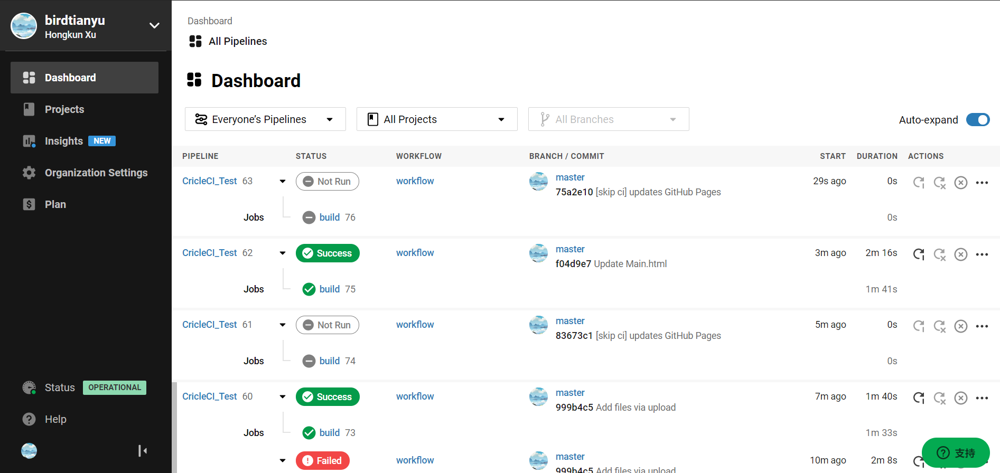
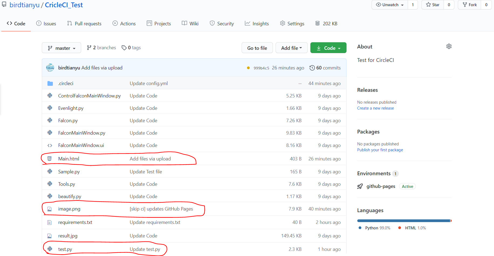
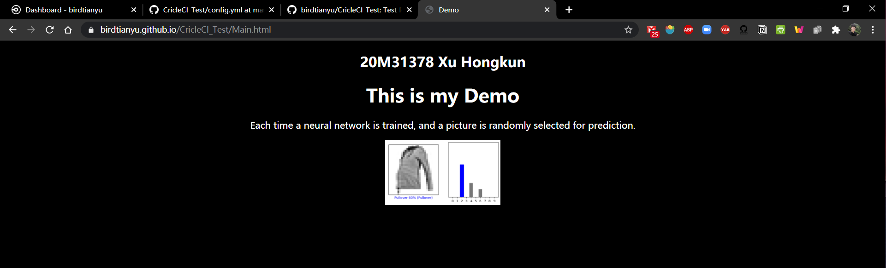

# デプロイと冪等性のレポート

## 名前: Xu Hongkun  　学籍番号: 20M31378


## デプロイと冪等性

> **演習1　*授業で作ったリポジトリの中に適当なブランチを作り，GitHub Pagesとして公開してみよ***

演習１で使ったリポジトリ：https://github.com/birdtianyu/XuHongkun-sysdev-2020

公開したページ：https://birdtianyu.github.io/XuHongkun-sysdev-2020/foo.txt

結果は次の通りです。





> **演習2　*授業で作ったリポジトリのCircleCIでGitHub Pagesへデプロイせよ***

演習２で使ったリポジトリ：https://github.com/birdtianyu/CricleCI_Test

``````bash
$ ssh-keygen -m PEM -t rsa -C "birdtianyu@gmail.com"
``````

①上のコマンドを利用してSSH用の鍵ペアを生成します。




②GitHubへDeploy keyを追加します。



③CircleCIへDeploy keyを追加します。



④`config.yml`に，デプロイに用いる鍵を記入します。


``````yml
version: 2.1
jobs:
  build:
    docker:
      - image: circleci/python:3.6.4
    steps:
      - checkout
      - run: echo "Hello World !"
      - add_ssh_keys:
          fingerprints:
            - "0a:6b:92:c6:4a:39:6b:4f:50:ee:37:21:3a:ed:aa:00"
      - run:
          name: ダミー アーティファクトの作成
          command: |
            echo "my artifact file" > /tmp/artifact1.txt;
            mkdir /tmp/artifacts;
            echo "my artifact files in a dir" > /tmp/artifacts/artifact2.txt;
      - store_artifacts:
          path: /tmp/artifact1.txt
          destination: artifact-file

      - store_artifacts:
          path: /tmp/artifacts
          
      - run:
          name: Unit Test
          command: |
            echo "Start My Unit Test !"
            sudo pip install --upgrade pip
            sudo pip install -r requirements.txt
            
            git config --global user.name "birdtianyu"
            git config --global user.email "birdtianyu@gmail.com"
            python -m unittest discover
            git add image.png
            git commit -m "[skip ci] updates GitHub Pages"
            if [ $? -ne 0 ]; then
              echo "nothing to commit"
              exit 0
            fi
            git push -f origin 
``````

⑤CircleCIの中で動的に`image.png`ファイルを生成し，GitHub Pagesへ追加します。

> `image.png`というファイルは`test.py`から生成したものです。
>
> `test.py`は毎回一つのニューラルネットワークを訓練して、テストデータセットからランダムに一枚の画像を抽出して分類を予測します。
>
> その画像と予測した分類を`image.png`として出力します。

CircleCIの中で動的にファイルを生成した結果：



自動にGithubにpushします。その結果：



生成した画像を表示するために、`Main.html`というHTMLファイルを作りました。

下記のページをアクセスすれば、

https://birdtianyu.github.io/CricleCI_Test/Main.html

次のページが表示されます。（真ん中の画像は即ち生成したものです。毎回ビルドした後、画像と予測した内容が違います。）




> **演習3　*冪等でない操作をいくつか挙げ，それが冪等にならない場合を説明せよ***

#### 継続的デリバリ (Continuous Delivery, CD)

自動的にビルドし，検証環境にデプロイし，テストすることで，本番環境にデプロイ可能な状態にすること。

https://www.ruanyifeng.com/blog/2015/09/continuous-integration.html


#### 冪等性 (Idempotence)

ある操作を1回あるいは複数回実施しても同じ結果になる性質

> 例：`$ mkdir -p abc`
>
> ディレクトリabcの有無に依らず，生成された状態になる


####  冪等でない操作

1. 複数のウィンドウの切り替え操作（Windowsなら、`Alt`+`Tab`キー）。毎回異なるウィンドウに切り替わります。
2. 平方根を求める関数。`sqrt(16)`の結果は`4`です。`4`を更に`sqrt()`に渡すと、結果が`2`になります。
3. HTTPのPOSTメソッド。複数回の呼び出しで新たなリソースが生成されます。


#### Ansible

冪等なデプロイを支援するツールです。

詳しくは：https://www.ansible.com/

分かりやすい説明資料：[Ansibleとは何か　構成管理ツールの目的〜Ansible導入まで最速で理解する](https://qiita.com/Brutus/items/1894629105d61f4854bc)