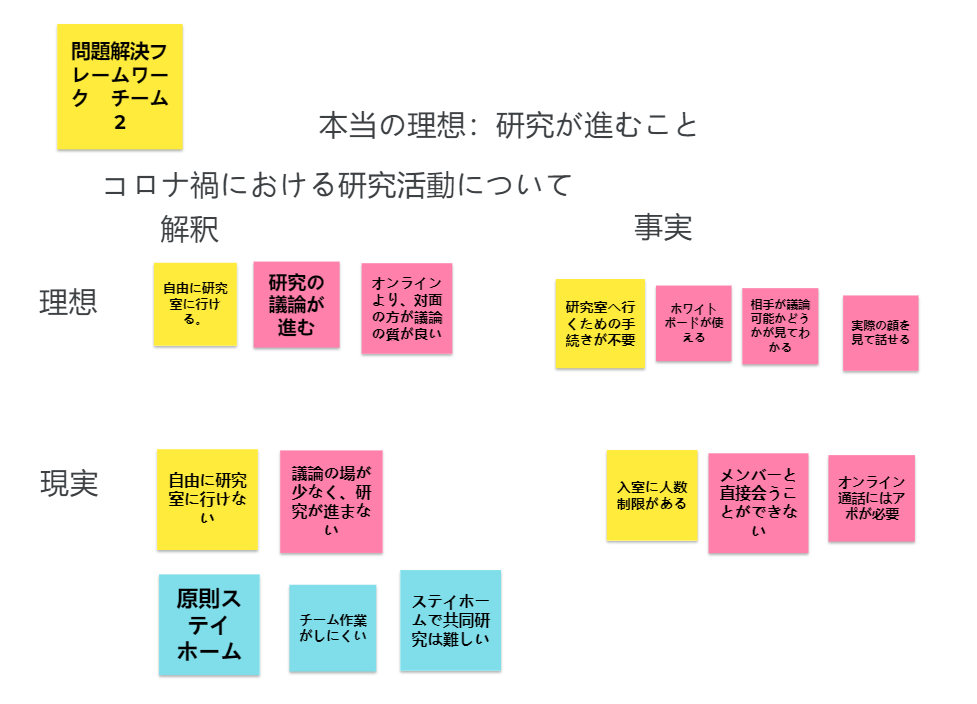
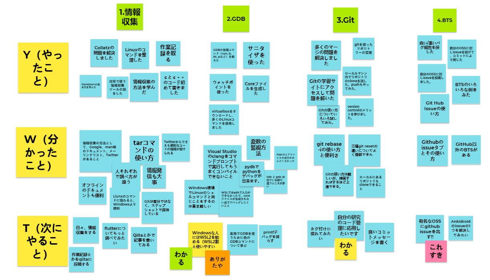
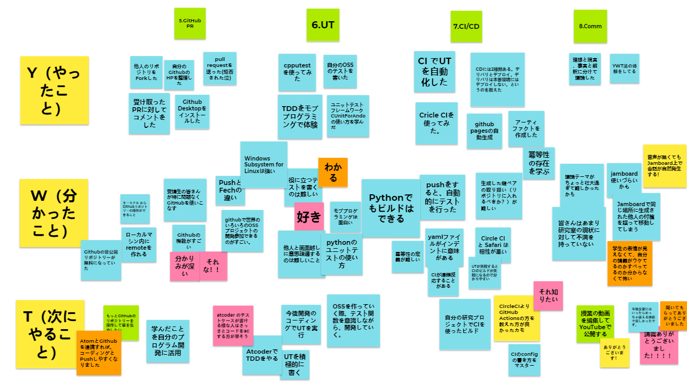

# コミュニケーションのレポート

## 名前: Xu Hongkun  　学籍番号: 20M31378

## コミュニケーション

> **演習1　*現状の大学運営（授業形態や研究室運営など）に関し問題を1つ挙げよ***

#### HRT：チームで働くときの「三本柱」

謙虚（Humility）, 尊敬（Respect）,信頼（Trust）

我々は「コロナ禍における研究活動について」議論しました。

そして、現実から理想への問題は「研究室に行けない」「ディスカッションはオンラインでやる」とまとめました。

> **演習2　*YWT法を用いて3Qを振り返る***

#### YWT法

+ やったこと
+ 分かったこと
+ 次にやること

YWT法を用いて、皆さんと一緒に3Qの内容を振り返りました。

この授業のおかげでいろいろな開発ツールと方法を学びました。

これから、学んだことを自分のOSS開発に活用して、いつかすごいOSSを自分の開発チームと一緒に作りたいと思います！

